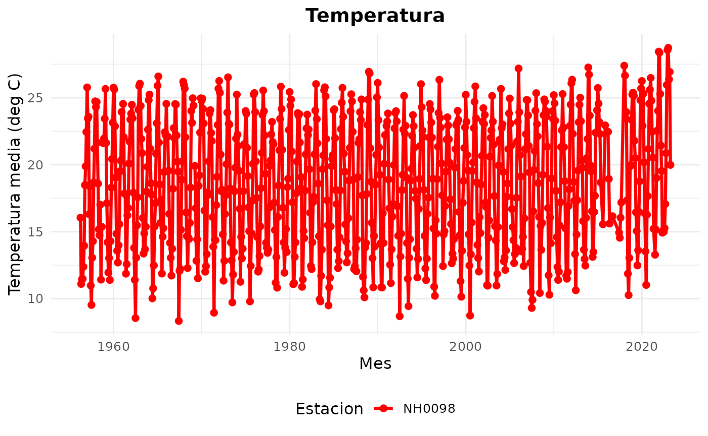
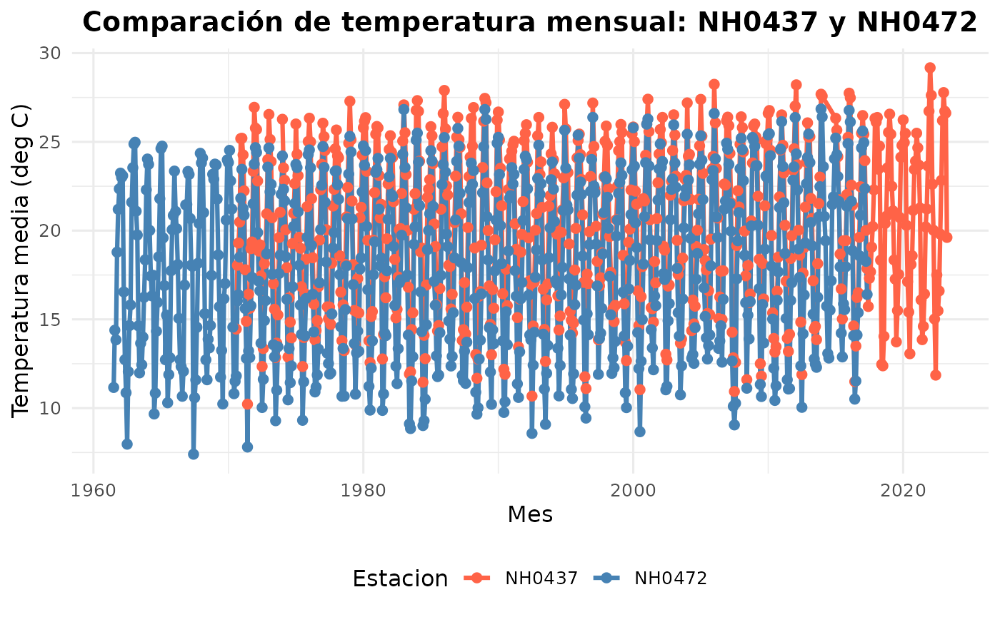

# uso_paquete

## Cargar paquetes necesarios

``` r
library(analisismeteorologico)
library(dplyr)
#> 
#> Attaching package: 'dplyr'
#> The following objects are masked from 'package:stats':
#> 
#>     filter, lag
#> The following objects are masked from 'package:base':
#> 
#>     intersect, setdiff, setequal, union
library(tidyr)
library(lubridate)
#> 
#> Attaching package: 'lubridate'
#> The following objects are masked from 'package:base':
#> 
#>     date, intersect, setdiff, union
```

## 1. INTRODUCCIÓN

El paquete analisismeteorologico fue desarrollado para facilitar la
descarga, limpieza, combinación y análisis de datos provenientes de
distintas estaciones meteorológicas.

En esta viñeta se muestran, paso a paso, las funciones principales del
paquete y cómo utilizarlas de manera integrada.

## 2. CARGAR LOS DATOS DE UNA FUNCIÓN

La función **leer_estacion()** permite descargar o leer desde un archivo
local los datos correspondientes a una estación meteorológica específica
o varias a la vez.

Esta función realiza varias tareas automáticamente:

- Valida el ID de estación

- Crea la carpeta si no existe

- Descarga el archivo si no está disponible dentro de la carpeta /datos

- Lee los datos y devuelve un data.frame con la información de la
  estación.

**Ejemplo de uso:**

- Para cargar una estacion

``` r
NH0098 <- leer_estacion("NH0098", "datos/NH0098.csv")
#> El archivo ya existe en la ruta indicada. Leyendo archivo 'datos/NH0098.csv
#> Lectura completada. El dataset de la estacion NH0098 tiene 23733 filas y 35
#> columnas.
head(NH0098)
#> # A tibble: 6 × 35
#>   id     fecha      temperatura_abrigo_150cm temperatura_abrigo_150cm_maxima
#>   <chr>  <date>                        <dbl>                           <dbl>
#> 1 NH0098 1956-04-01                     13.6                            21.6
#> 2 NH0098 1956-04-02                     16.8                            23.6
#> 3 NH0098 1956-04-03                     19                              25.9
#> 4 NH0098 1956-04-04                     17.6                            23.6
#> 5 NH0098 1956-04-05                     20                              27.2
#> 6 NH0098 1956-04-06                     19.2                            24.7
#> # ℹ 31 more variables: temperatura_abrigo_150cm_minima <dbl>,
#> #   temperatura_intemperie_5cm_minima <dbl>,
#> #   temperatura_intemperie_50cm_minima <lgl>,
#> #   temperatura_suelo_5cm_media <dbl>, temperatura_suelo_10cm_media <dbl>,
#> #   temperatura_inte_5cm <lgl>, temperatura_intemperie_150cm_minima <lgl>,
#> #   humedad_suelo <lgl>, precipitacion_pluviometrica <dbl>, granizo <dbl>,
#> #   nieve <dbl>, heliofania_efectiva <dbl>, heliofania_relativa <dbl>, …
```

Esta salida tambien muestra las primeras filas del dataset de ejemplo
para entender la estructura de las variables.

- Para cargar varias estaciones:

``` r
todas_estaciones <- dplyr::bind_rows(
  leer_estacion("NH0437", "datos/NH0437.csv"),
  leer_estacion("NH0472", "datos/NH0472.csv"),
  leer_estacion("NH0098", "datos/NH0098.csv")
)
#> El archivo ya existe en la ruta indicada. Leyendo archivo 'datos/NH0437.csv
#> Lectura completada. El dataset de la estacion NH0437 tiene 18929 filas y 35
#> columnas.
#> El archivo ya existe en la ruta indicada. Leyendo archivo 'datos/NH0472.csv
#> Lectura completada. El dataset de la estacion NH0472 tiene 20425 filas y 35
#> columnas.
#> El archivo ya existe en la ruta indicada. Leyendo archivo 'datos/NH0098.csv
#> Lectura completada. El dataset de la estacion NH0098 tiene 23733 filas y 35
#> columnas.

head(todas_estaciones)
#> # A tibble: 6 × 35
#>   id     fecha      temperatura_abrigo_150cm temperatura_abrigo_150cm_maxima
#>   <chr>  <date>                        <dbl>                           <dbl>
#> 1 NH0437 1970-08-01                     23.3                            31.2
#> 2 NH0437 1970-08-02                     26.6                            32.1
#> 3 NH0437 1970-08-03                     17.4                            22.9
#> 4 NH0437 1970-08-04                     11.0                            11.9
#> 5 NH0437 1970-08-05                     11.1                            12.6
#> 6 NH0437 1970-08-06                     13.6                            15.1
#> # ℹ 31 more variables: temperatura_abrigo_150cm_minima <dbl>,
#> #   temperatura_intemperie_5cm_minima <dbl>,
#> #   temperatura_intemperie_50cm_minima <dbl>,
#> #   temperatura_suelo_5cm_media <dbl>, temperatura_suelo_10cm_media <dbl>,
#> #   temperatura_inte_5cm <lgl>, temperatura_intemperie_150cm_minima <lgl>,
#> #   humedad_suelo <lgl>, precipitacion_pluviometrica <dbl>, granizo <dbl>,
#> #   nieve <dbl>, heliofania_efectiva <dbl>, heliofania_relativa <dbl>, …
```

## 3. TABLA CON RESUMEN DE TEMPERATURA

La función **tabla_resumen_temperatura()** permite obtener un resumen
estadístico completo de la temperatura registrada en una o varias
estaciones meteorológicas.

Esta función automatiza todo el proceso:

- Descarga los datos si no están disponibles

- Lee cada archivo y lo combina en un único data frame

- Calcula estadísticas descriptivas clave

- Devuelve un dataframe con la información resumida por estación

**¿Qué estadísticas calcula?**

Para cada estación, la función calcula:

Estadística Descripción n -\> Cantidad de observaciones válidas (sin NA)
minimo -\> Temperatura mínima registrada maximo -\> Temperatura máxima
registrada media -\> Promedio de temperatura mediana -\> Temperatura
central del conjunto sd -\> Desvío estándar

- Tabla resumen para una sola estación

``` r
resumen_1 <- tabla_resumen_temperatura(
  estaciones = c("NH0098"),
  carpeta = "datos"
)
#> El archivo ya existe en la ruta indicada. Leyendo archivo 'datos/NH0098.csv
#> Lectura completada. El dataset de la estacion NH0098 tiene 23733 filas y 35
#> columnas.
```

- Tabla resumen para varias estaciones:

``` r
resumen_2 <- tabla_resumen_temperatura(
  estaciones = c("NH0098", "NH0437", "NH0472"),
  carpeta = "datos"
)
#> El archivo ya existe en la ruta indicada. Leyendo archivo 'datos/NH0098.csv
#> Lectura completada. El dataset de la estacion NH0098 tiene 23733 filas y 35
#> columnas.
#> El archivo ya existe en la ruta indicada. Leyendo archivo 'datos/NH0437.csv
#> Lectura completada. El dataset de la estacion NH0437 tiene 18929 filas y 35
#> columnas.
#> El archivo ya existe en la ruta indicada. Leyendo archivo 'datos/NH0472.csv
#> Lectura completada. El dataset de la estacion NH0472 tiene 20425 filas y 35
#> columnas.
```

- Comparar entre dos estaciones

``` r
resumen_2 <- tabla_resumen_temperatura(
  estaciones = c("NH0098", "NH0437"),
  carpeta = "datos"
)
#> El archivo ya existe en la ruta indicada. Leyendo archivo 'datos/NH0098.csv
#> Lectura completada. El dataset de la estacion NH0098 tiene 23733 filas y 35
#> columnas.
#> El archivo ya existe en la ruta indicada. Leyendo archivo 'datos/NH0437.csv
#> Lectura completada. El dataset de la estacion NH0437 tiene 18929 filas y 35
#> columnas.
resumen_2
#> # A tibble: 2 × 7
#>   estacion     n minimo maximo media mediana    sd
#>   <chr>    <int>  <dbl>  <dbl> <dbl>   <dbl> <dbl>
#> 1 NH0098   23540  -17.4   37.4  18.6    19.1  5.98
#> 2 NH0437   18738    2.1   36.3  20.2    21    5.77
```

- Tabla con TODAS las estaciones

``` r
resumen_todas <- tabla_resumen_temperatura(
  estaciones = c("NH0472", "NH0910", "NH0046", "NH0098", "NH0437")
)
#> El archivo ya existe en la ruta indicada. Leyendo archivo 'datos/NH0472.csv
#> Lectura completada. El dataset de la estacion NH0472 tiene 20425 filas y 35
#> columnas.
#> El archivo ya existe en la ruta indicada. Leyendo archivo 'datos/NH0910.csv
#> Lectura completada. El dataset de la estacion NH0910 tiene 15553 filas y 35
#> columnas.
#> El archivo ya existe en la ruta indicada. Leyendo archivo 'datos/NH0046.csv
#> Lectura completada. El dataset de la estacion NH0046 tiene 17041 filas y 35
#> columnas.
#> El archivo ya existe en la ruta indicada. Leyendo archivo 'datos/NH0098.csv
#> Lectura completada. El dataset de la estacion NH0098 tiene 23733 filas y 35
#> columnas.
#> El archivo ya existe en la ruta indicada. Leyendo archivo 'datos/NH0437.csv
#> Lectura completada. El dataset de la estacion NH0437 tiene 18929 filas y 35
#> columnas.

resumen_todas
#> # A tibble: 5 × 7
#>   estacion     n minimo maximo media mediana    sd
#>   <chr>    <int>  <dbl>  <dbl> <dbl>   <dbl> <dbl>
#> 1 NH0046   16782  -0.25   34.6  17.3    17.6  5.90
#> 2 NH0098   23540 -17.4    37.4  18.6    19.1  5.98
#> 3 NH0437   18738   2.1    36.3  20.2    21    5.77
#> 4 NH0472   20359   0.55   34.8  18.0    18.5  5.94
#> 5 NH0910   15506   0      35.2  17.7    18    6.12
```

## 4. GRÁFICOS

La función **grafico_temperatura_mensual()** permite visualizar de
manera clara la evolución de la temperatura promedio mensual registrada
en una o varias estaciones meteorológicas.

- Gráfico para una sola estación

``` r
# Cargar la estación NH0098
datos_NH0098 <- leer_estacion("NH0098", "datos/NH0098.csv")
#> El archivo ya existe en la ruta indicada. Leyendo archivo 'datos/NH0098.csv
#> Lectura completada. El dataset de la estacion NH0098 tiene 23733 filas y 35
#> columnas.

# Generar el gráfico de temperatura mensual
grafico <- grafico_temperatura_mensual(
  datos = datos_NH0098,
  colores = "darkgreen",
  titulo = "Temperatura mensual NH0098"
)
#> Grafico generado correctamente.

# Mostrar el gráfico
print(grafico)
#> Warning: Removed 3 rows containing missing values or values outside the scale range
#> (`geom_point()`).
```


- Grafico con color y titulo por defecto:

``` r
grafico <- grafico_temperatura_mensual(datos_NH0098)
#> Grafico generado correctamente.

print(grafico)
#> Warning: Removed 3 rows containing missing values or values outside the scale range
#> (`geom_point()`).
```



- Comparación entre dos estaciones

``` r
# Cargar datos de dos estaciones
estaciones <- dplyr::bind_rows(
  leer_estacion("NH0437", "datos/NH0437.csv"),
  leer_estacion("NH0472", "datos/NH0472.csv")
)
#> El archivo ya existe en la ruta indicada. Leyendo archivo 'datos/NH0437.csv
#> Lectura completada. El dataset de la estacion NH0437 tiene 18929 filas y 35
#> columnas.
#> El archivo ya existe en la ruta indicada. Leyendo archivo 'datos/NH0472.csv
#> Lectura completada. El dataset de la estacion NH0472 tiene 20425 filas y 35
#> columnas.

# Generar gráfico comparativo
grafico_comparacion <- grafico_temperatura_mensual(
  datos = estaciones,
  colores = c("tomato", "steelblue"),
  titulo = "Comparación de temperatura mensual: NH0437 y NH0472"
)
#> Grafico generado correctamente.

# Mostrar el gráfico
print(grafico_comparacion)
#> Warning: Removed 1 row containing missing values or values outside the scale range
#> (`geom_line()`).
#> Warning: Removed 2 rows containing missing values or values outside the scale range
#> (`geom_point()`).
```



- Gráfico que incluya todas las estaciones

``` r
todos <- dplyr::bind_rows(
  leer_estacion("NH0437", "datos/NH0437.csv"),
  leer_estacion("NH0472", "datos/NH0472.csv"),
  leer_estacion("NH0910", "datos/NH0910.csv"),
  leer_estacion("NH0046", "datos/NH0046.csv"),
  leer_estacion("NH0098", "datos/NH0098.csv")
)
#> El archivo ya existe en la ruta indicada. Leyendo archivo 'datos/NH0437.csv
#> Lectura completada. El dataset de la estacion NH0437 tiene 18929 filas y 35
#> columnas.
#> El archivo ya existe en la ruta indicada. Leyendo archivo 'datos/NH0472.csv
#> Lectura completada. El dataset de la estacion NH0472 tiene 20425 filas y 35
#> columnas.
#> El archivo ya existe en la ruta indicada. Leyendo archivo 'datos/NH0910.csv
#> Lectura completada. El dataset de la estacion NH0910 tiene 15553 filas y 35
#> columnas.
#> El archivo ya existe en la ruta indicada. Leyendo archivo 'datos/NH0046.csv
#> Lectura completada. El dataset de la estacion NH0046 tiene 17041 filas y 35
#> columnas.
#> El archivo ya existe en la ruta indicada. Leyendo archivo 'datos/NH0098.csv
#> Lectura completada. El dataset de la estacion NH0098 tiene 23733 filas y 35
#> columnas.

grafico_temperatura_mensual(
  todos,
  colores = c("red", "blue", "green", "purple", "orange"),
  titulo = "Temperatura mensual – todas las estaciones"
)
#> Grafico generado correctamente.
#> Warning: Removed 1 row containing missing values or values outside the scale range
#> (`geom_line()`).
#> Warning: Removed 11 rows containing missing values or values outside the scale range
#> (`geom_point()`).
```


**Autores:**  
*Catalina Vujovich*  
