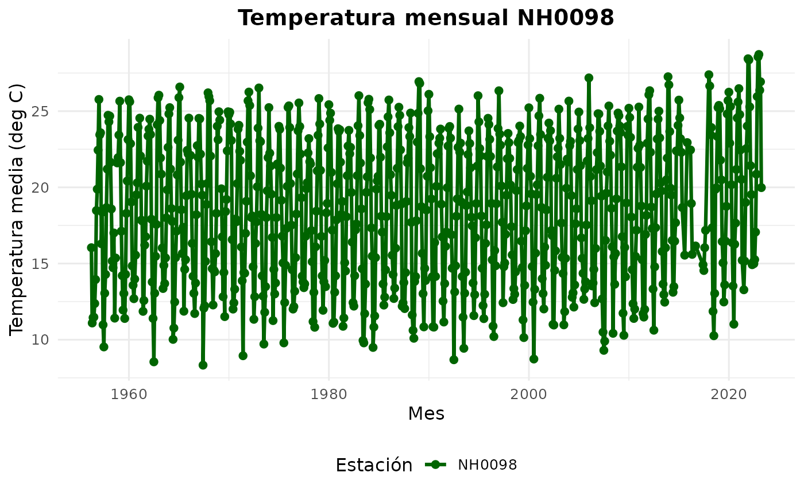
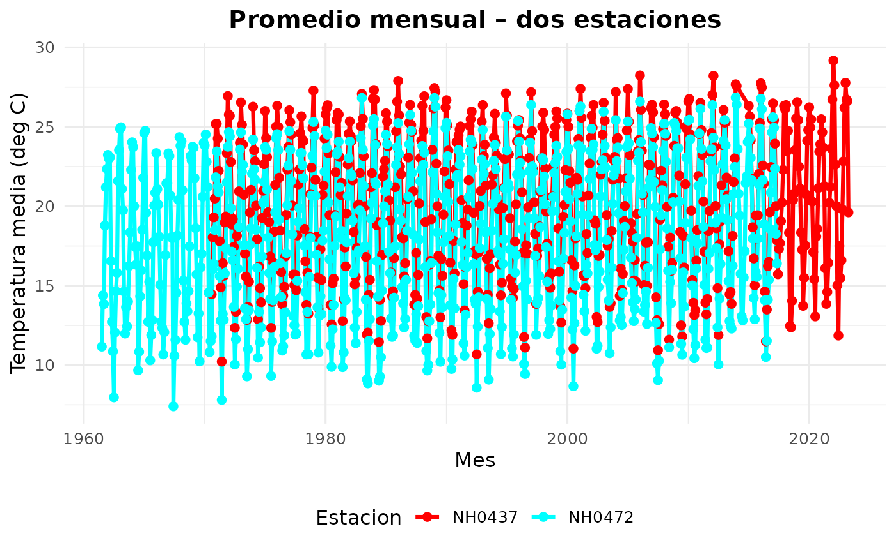
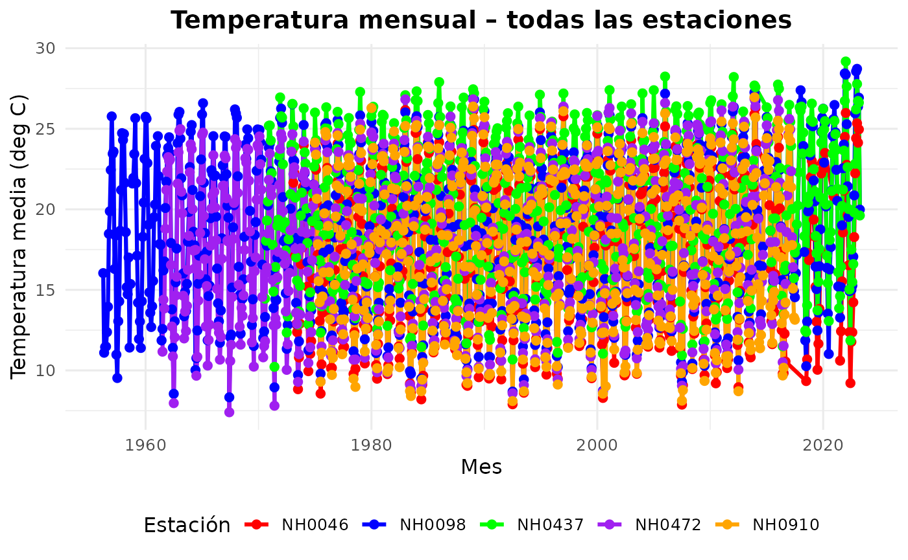

# uso_paquete

## 1. Introducción

El paquete analisismeteorologico fue desarrollado para facilitar la
descarga, limpieza, combinación y análisis de datos provenientes de
distintas estaciones meteorológicas.

En esta viñeta se muestran, paso a paso, las funciones principales del
paquete y cómo utilizarlas de manera integrada. También se presenta el
dataset datos_meteorologicos, incluido dentro del paquete, que reúne la
información de cinco estaciones distintas.

## 2. CARGAR LOS DATOS DE UNA FUNCIÓN

La función leer_estacion() permite descargar o leer desde un archivo
local los datos correspondientes a una estación meteorológica
específica.

Esta función realiza varias tareas automáticamente:

- Valida el ID de estación

- Crea la carpeta si no existe

- Descarga el archivo si no está disponible

- Lo lee en un data frame listo para usar

Ejemplo de uso: Estacion_NH0098 \<- leer_estacion(“NH0098”,
“datos/NH0098.csv”) head(Estacion_00980098)

Esta salida tambien muestra las primeras filas del dataset de ejemplo
para entender la estructura de las variables.

## 3. TABLA CON RESUMEN DE TEMPERATURA

La función tabla_resumen_temperatura() permite obtener un resumen
estadístico completo de la temperatura registrada en una o varias
estaciones meteorológicas.

Esta función automatiza todo el proceso:

Descarga los datos si no están disponibles

Lee cada archivo y lo combina en un único data frame

Calcula estadísticas descriptivas clave

Devuelve una tabla con una fila por estación

¿Qué estadísticas calcula?

Para cada estación, la función calcula:

Estadística Descripción n -\> Cantidad de observaciones válidas (sin NA)
minimo -\> Temperatura mínima registrada maximo -\> Temperatura máxima
registrada media -\> Promedio de temperatura mediana -\> Temperatura
central del conjunto sd -\> Desvío estándar (variabilidad)

- Resumen para UNA SOLA estación

``` r
resumen_1 <- tabla_resumen_temperatura(
  estaciones = c("NH0098"),
  carpeta = "datos"
)
#> El archivo ya existe en la ruta indicada. Leyendo archivo 'datos/NH0098.csv'…
#> Lectura completada. El dataset de la estación NH0098 tiene 23733 filas y 35
#> columnas.

resumen_1
#> # A tibble: 1 × 7
#>   estacion     n minimo maximo media mediana    sd
#>   <chr>    <int>  <dbl>  <dbl> <dbl>   <dbl> <dbl>
#> 1 NH0098   23540  -17.4   37.4  18.6    19.1  5.98
```

- Comparar entre dos estaciones

``` r
resumen_2 <- tabla_resumen_temperatura(
  estaciones = c("NH0098", "NH0437"),
  carpeta = "datos"
)
#> El archivo ya existe en la ruta indicada. Leyendo archivo 'datos/NH0098.csv'…
#> Lectura completada. El dataset de la estación NH0098 tiene 23733 filas y 35
#> columnas.
#> El archivo ya existe en la ruta indicada. Leyendo archivo 'datos/NH0437.csv'…
#> Lectura completada. El dataset de la estación NH0437 tiene 18929 filas y 35
#> columnas.
resumen_2
#> # A tibble: 2 × 7
#>   estacion     n minimo maximo media mediana    sd
#>   <chr>    <int>  <dbl>  <dbl> <dbl>   <dbl> <dbl>
#> 1 NH0098   23540  -17.4   37.4  18.6    19.1  5.98
#> 2 NH0437   18738    2.1   36.3  20.2    21    5.77
```

- Tabla con TODAS las estaciones

``` r
resumen_todas <- tabla_resumen_temperatura(
  estaciones = c("NH0472", "NH0910", "NH0046", "NH0098", "NH0437")
)
#> El archivo ya existe en la ruta indicada. Leyendo archivo 'datos/NH0472.csv'…
#> Lectura completada. El dataset de la estación NH0472 tiene 20425 filas y 35
#> columnas.
#> El archivo ya existe en la ruta indicada. Leyendo archivo 'datos/NH0910.csv'…
#> Lectura completada. El dataset de la estación NH0910 tiene 15553 filas y 35
#> columnas.
#> El archivo ya existe en la ruta indicada. Leyendo archivo 'datos/NH0046.csv'…
#> Lectura completada. El dataset de la estación NH0046 tiene 17041 filas y 35
#> columnas.
#> El archivo ya existe en la ruta indicada. Leyendo archivo 'datos/NH0098.csv'…
#> Lectura completada. El dataset de la estación NH0098 tiene 23733 filas y 35
#> columnas.
#> El archivo ya existe en la ruta indicada. Leyendo archivo 'datos/NH0437.csv'…
#> Lectura completada. El dataset de la estación NH0437 tiene 18929 filas y 35
#> columnas.

resumen_todas
#> # A tibble: 5 × 7
#>   estacion     n minimo maximo media mediana    sd
#>   <chr>    <int>  <dbl>  <dbl> <dbl>   <dbl> <dbl>
#> 1 NH0046   16782  -0.25   34.6  17.3    17.6  5.90
#> 2 NH0098   23540 -17.4    37.4  18.6    19.1  5.98
#> 3 NH0437   18738   2.1    36.3  20.2    21    5.77
#> 4 NH0472   20359   0.55   34.8  18.0    18.5  5.94
#> 5 NH0910   15506   0      35.2  17.7    18    6.12
```

## GRÁFICOS

La función grafico_temperatura_mensual() permite visualizar de manera
clara la evolución de la temperatura promedio mensual registrada en una
o varias estaciones meteorológicas.

- Gráfico para una sola estación

``` r
grafico <- grafico_temperatura_mensual(
  NH0098,
  colores = "darkgreen",
  titulo = "Temperatura mensual NH0098"
)
#> Gráfico generado correctamente.

grafico
#> Warning: Removed 3 rows containing missing values or values outside the scale range
#> (`geom_point()`).
```



- Comparación entre dos estaciones

``` r
multi <- dplyr::bind_rows(
  leer_estacion("NH0437", "datos/NH0437.csv"),
  leer_estacion("NH0472", "datos/NH0472.csv")
)
#> El archivo ya existe en la ruta indicada. Leyendo archivo 'datos/NH0437.csv'…
#> Lectura completada. El dataset de la estación NH0437 tiene 18929 filas y 35
#> columnas.
#> El archivo ya existe en la ruta indicada. Leyendo archivo 'datos/NH0472.csv'…
#> Lectura completada. El dataset de la estación NH0472 tiene 20425 filas y 35
#> columnas.

grafico2 <- grafico_temperatura_mensual(
  multi,
  titulo = "Promedio mensual – dos estaciones"
)
#> Gráfico generado correctamente.

grafico2
#> Warning: Removed 1 row containing missing values or values outside the scale range
#> (`geom_line()`).
#> Warning: Removed 2 rows containing missing values or values outside the scale range
#> (`geom_point()`).
```



- Gráfico que incluya todas las estaciones

``` r
todas <- dplyr::bind_rows(
  leer_estacion("NH0437", "datos/NH0437.csv"),
  leer_estacion("NH0472", "datos/NH0472.csv"),
  leer_estacion("NH0910", "datos/NH0910.csv"),
  leer_estacion("NH0046", "datos/NH0046.csv"),
  leer_estacion("NH0098", "datos/NH0098.csv")
)
#> El archivo ya existe en la ruta indicada. Leyendo archivo 'datos/NH0437.csv'…
#> Lectura completada. El dataset de la estación NH0437 tiene 18929 filas y 35
#> columnas.
#> El archivo ya existe en la ruta indicada. Leyendo archivo 'datos/NH0472.csv'…
#> Lectura completada. El dataset de la estación NH0472 tiene 20425 filas y 35
#> columnas.
#> El archivo ya existe en la ruta indicada. Leyendo archivo 'datos/NH0910.csv'…
#> Lectura completada. El dataset de la estación NH0910 tiene 15553 filas y 35
#> columnas.
#> El archivo ya existe en la ruta indicada. Leyendo archivo 'datos/NH0046.csv'…
#> Lectura completada. El dataset de la estación NH0046 tiene 17041 filas y 35
#> columnas.
#> El archivo ya existe en la ruta indicada. Leyendo archivo 'datos/NH0098.csv'…
#> Lectura completada. El dataset de la estación NH0098 tiene 23733 filas y 35
#> columnas.

grafico_temperatura_mensual(
  todas,
  colores = c("red", "blue", "green", "purple", "orange"),
  titulo = "Temperatura mensual – todas las estaciones"
)
#> Gráfico generado correctamente.
#> Warning: Removed 1 row containing missing values or values outside the scale range
#> (`geom_line()`).
#> Warning: Removed 11 rows containing missing values or values outside the scale range
#> (`geom_point()`).
```



**Autores:**  
*Catalina Vujovich*  
